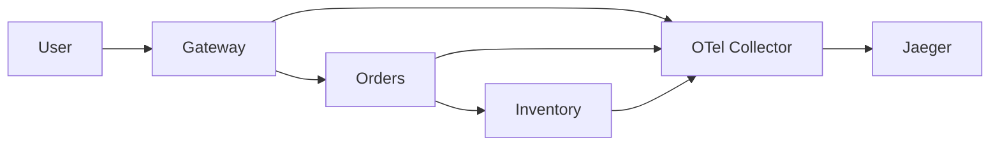

# Lab 3 — OpenTelemetry, Collector, Jaeger, and Trace Sampling

**Target time:** 45 minutes  
**Core skill:** Follow one request across three services and identify the real latency bottleneck.

## Instructor preparation

- Students should have finished the earlier labs or at least understand the same `gateway → orders → inventory` service topology.
- Stop the logging stack before this lab if memory is tight.
- Open Jaeger at `http://localhost:16686` after startup.

## Student objective

Students will:

1. Start the demo services with OpenTelemetry enabled.
2. Send spans to an OpenTelemetry Collector over OTLP.
3. Export spans from the Collector to Jaeger.
4. Find a trace and inspect parent/child spans.
5. Identify the slow service and explain why a metric alone would not prove it.
6. Compare head-based and tail-based sampling conceptually.

## Expected result

A single `GET /checkout` trace contains spans for:

`gateway → orders → inventory`

The slow version clearly shows a downstream inventory span dominating the critical path.

## Common failure

The common problem is an empty Jaeger search result. Check the application environment variables and Collector logs first. If the applications are sending to `otel-collector:4317`, verify that the Collector is running and that the `traces` pipeline is configured.

## Teaching point

The value of tracing is **causal timing**: it shows which dependency consumed the request's latency budget.

---

## 1. Set student scope

Create a unique Compose project scope.

```bash
export STUDENT="student01"  # Pick a unique student identifier
```

Scope all trace-lab resources under one Compose project.

```bash
export COMPOSE_PROJECT_NAME="observe-${STUDENT}"  # Isolate trace-lab resources
```

Render the complete configuration set.

```bash
./Manifests/render-manifests.sh  # Generate the trace-lab files
```

## 2. Validate the trace Compose file

Validate the Compose model before creating containers.

```bash
docker compose -f Manifests/rendered/traces/docker-compose.yml config  # Check YAML and interpolation
```

## 3. Start the tracing stack

Start the OTel Collector, Jaeger, and instrumented demo services.

```bash
docker compose -f Manifests/rendered/traces/docker-compose.yml up -d --build  # Build the instrumented app and start tracing
```

Verify all services are running.

```bash
docker compose -f Manifests/rendered/traces/docker-compose.yml ps  # Confirm collector, Jaeger, and apps are healthy
```

## 4. Understand the trace path



OpenTelemetry's Collector supports OTLP/gRPC on port `4317` by default; this lab uses that endpoint for application-to-collector transport. citeturn980876search0turn980876search4

## 5. Generate a normal trace

Send one normal checkout request.

```bash
curl -fsS -H 'X-Request-ID: trace-demo-001' http://localhost:8080/checkout >/dev/null  # Create a distributed request with trace context
```

## 6. Generate a slow trace

Send a checkout request that makes inventory intentionally slow.

```bash
curl -fsS -H 'X-Request-ID: trace-slow-001' 'http://localhost:8080/checkout?slow=1' >/dev/null  # Create a visible downstream latency bottleneck
```

## 7. Open Jaeger

Open `http://localhost:16686`.

Jaeger all-in-one exposes the trace UI on port `16686` and supports OTLP ingestion on `4317`/`4318`. The current Jaeger documentation uses the same all-in-one pattern for lightweight local deployments. citeturn980876search6turn980876search11

Search for:

- service: `gateway`
- operation containing `/checkout`

Open the slowest recent trace.

## 8. Read a trace as a timeline

Students should point to:

1. gateway server span
2. outgoing HTTP span to orders
3. orders server span
4. outgoing HTTP span to inventory
5. inventory server span

### Instructor question

Ask: **“Which span owns the latency?”**

Expected answer: the slow inventory work, because the child span consumes the largest portion of the critical path.

## 9. Context propagation

### What is it?

- The current trace context is propagated from one service to another.
- Child spans inherit the trace ID and parent/child relationship.
- The HTTP client instrumentation handles the header propagation for this lab.

### Why does it matter?

- Without context propagation, each service would produce disconnected traces.
- Correlation between services becomes automatic instead of manual.
- The same trace ID can later be inserted into structured logs.

### What should I remember?

**Distributed tracing only works as one trace when context is propagated.**

OpenTelemetry's Python guidance describes manual instrumentation as SDK/API setup plus application or library instrumentation; instrumentation libraries such as HTTPX can create client spans automatically. citeturn351895search0turn351895search4

## 10. Semantic conventions

### What is it?

- Semantic conventions define standard attribute names and meanings.
- HTTP instrumentation can use standardized attributes such as route, method, status, and server/client roles.

### Why does it matter?

- Common names make telemetry portable between vendors and backends.
- Analysts can query the same concepts across services.
- Standard attributes reduce custom naming debt.

### What should I remember?

**Prefer standard telemetry attributes before inventing your own.**

## 11. OTel Collector

Inspect the rendered Collector config in `Manifests/rendered/traces/otel-collector-config.yaml`.

The workshop pipeline is:

```text
app → OTLP/gRPC → Collector receiver → batch processor → OTLP exporter → Jaeger
```

Inspect Collector startup and export logs.

```bash
docker compose -f Manifests/rendered/traces/docker-compose.yml logs --tail=80 otel-collector  # Verify the Collector receives and exports traces
```

Look for:

- successful startup
- no configuration errors
- no repeated export failures to Jaeger

## 12. Trace sampling

### Head-based sampling

Decision is made near trace start.

Example policy:

```text
sample 10% of traces
```

**Strength:** cheap and simple.  
**Weakness:** a rare error trace may be dropped before you know it matters.

### Tail-based sampling

Decision is made after enough trace data is collected to evaluate the whole trace.

Conceptual policy:

```text
keep all error traces
keep traces slower than 1 s
sample only 5% of successful fast traces
```

**Strength:** prioritizes unusual traces.  
**Weakness:** requires buffering and more Collector capacity.

### What should I remember?

**Sampling is an economic decision: preserve diagnostic value where the cost of keeping everything is too high.**

## Core completion check

Students should be able to answer:

> “The gateway p90 is high. Show me one slow checkout trace and identify the exact downstream operation consuming most of the latency.”

## Stretch: correlate the trace with logs

The application emits `trace_id` and `span_id` into JSON logs whenever a sampled trace context is present.

Use the same trace ID visible in Jaeger and search the logging system for:

```text
trace_id:<value-from-jaeger>
```

This is the bridge between the three pillars:

```text
Grafana → detect high latency
OpenSearch → find correlated request logs
Jaeger → locate the slow dependency
```


## 13. Clean up after the workshop

Stop and remove the trace-lab resources.

```bash
docker compose -f Manifests/rendered/traces/docker-compose.yml down -v  # Remove trace containers and the isolated network
```

## Debrief questions

- Why can the p90 metric tell us there is a problem but not which dependency caused it?
- What is the difference between a trace and a span?
- Why might tail sampling preserve better debugging value than a fixed head-based sample?
- Why does the application send telemetry to a Collector instead of directly to Jaeger?
