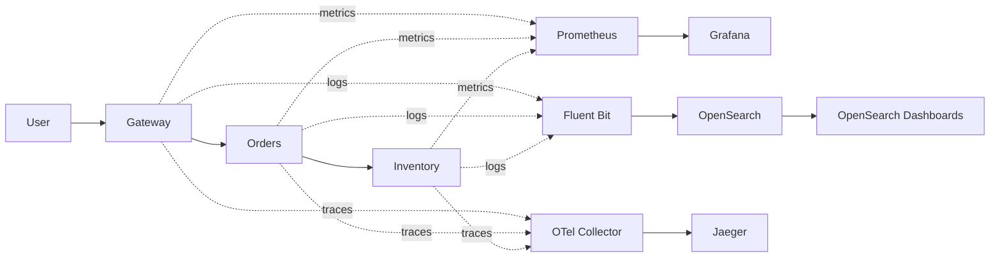
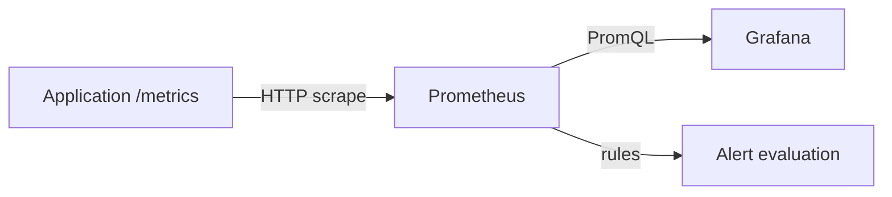
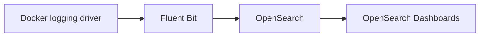
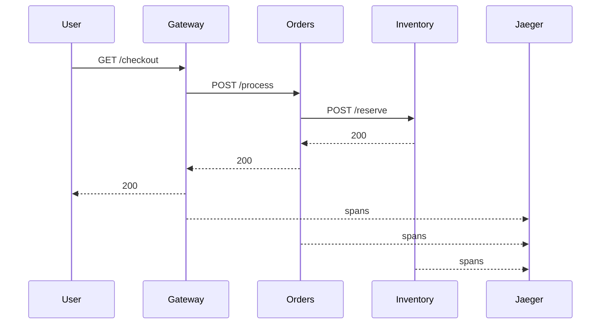

# Module — Observability Teaching Track

## 1. The three pillars

### What is it?

- **Metrics** are numeric measurements over time.
- **Logs** are discrete event records with context.
- **Traces** show the path and timing of a request across services.

### Why does it matter?

- Metrics are fast for detecting that a service is unhealthy.
- Logs explain what the service thought happened.
- Traces explain **where time and failure propagated across service boundaries**.
- Together they reduce the number of guesses during an incident.

### What should I remember?

**Metrics detect. Logs explain. Traces locate.**



---

## 2. Metrics types

### What is it?

- **Counter:** cumulative value that increases and may reset on restart.
- **Gauge:** value that can go up or down.
- **Histogram:** distribution represented by buckets, count, and sum.
- **Summary:** client-side sliding-window quantiles plus count and sum.

Prometheus documents these as its four core metric types. In practice, histograms are especially useful for request latency because the distribution can be aggregated across instances. citeturn422533search0turn422533search2

### Why does it matter?

- A counter answers “how many happened?” and becomes useful with `rate()`.
- A gauge answers “what is the state right now?”
- A histogram lets you reason about latency percentiles instead of averages.
- Summaries calculate quantiles inside the process and are harder to aggregate across replicas.

### What should I remember?

**Choose the type based on the question you need to answer.**

---

## 3. Prometheus architecture

### What is it?

- Prometheus periodically **scrapes** HTTP endpoints that expose metrics.
- It stores time series locally and evaluates PromQL expressions and alert rules.
- Labels identify dimensions such as `service`, `method`, and `route`.

### Why does it matter?

- Scraping keeps the ingestion path simple for small services.
- The target is responsible for exposing a stable metrics endpoint.
- Labels make one metric family reusable for many services—but excessive label cardinality makes the system expensive.

### What should I remember?

**Prometheus stores time series; labels create dimensions.**



Prometheus `scrape_config` defines targets and scrape behavior; configuration can also be reloaded at runtime. citeturn310537search4

---

## 4. PromQL essentials

### What is it?

- Select a time series: `app_http_requests_total`.
- Turn counters into rates: `rate(metric[5m])`.
- Aggregate dimensions: `sum by (service) (...)`.

### Why does it matter?

- Raw counters are rarely the useful dashboard value.
- Aggregation turns many series into service-level questions.
- PromQL can calculate SLO-oriented error ratios and latency percentiles directly from telemetry.

### What should I remember?

**Write queries that match an operational question, not a metric name.**

Useful workshop queries:

```promql
sum(rate(app_http_requests_total[5m])) by (service)
```

```promql
100 * sum(rate(app_http_requests_total{status=~"5.."}[5m])) / sum(rate(app_http_requests_total[5m]))
```

```promql
histogram_quantile(0.90, sum by (le, service) (rate(app_http_request_duration_seconds_bucket[5m])))
```

Prometheus recommends `rate()` for counters and provides `histogram_quantile()` for latency distributions. citeturn422533search1turn422533search5

---

## 5. Grafana dashboards and variables

### What is it?

- Grafana queries a data source and turns results into panels.
- Dashboard variables let one dashboard switch services or environments without cloning dashboards.
- Provisioning can define data sources and dashboards as files so they are version-controlled. citeturn310537search5

### Why does it matter?

- A dashboard should help an engineer make a decision quickly.
- SLO-oriented panels make “healthy” visible instead of rewarding vanity metrics.
- Variables reduce dashboard sprawl.

### What should I remember?

**A useful dashboard is an incident decision surface, not a wall of graphs.**

---

## 6. Four golden signals

### What is it?

- **Latency** — how long requests take.
- **Traffic** — demand or request rate.
- **Errors** — failed requests or failed outcomes.
- **Saturation** — how close the system is to a limiting resource or queue.

### Why does it matter?

- Together they give a compact starting point for service health.
- They are useful before you know the root cause.
- They map naturally to SLOs and incident severity.

### What should I remember?

**Start with latency, traffic, errors, and saturation before adding decorative metrics.**

---

## 7. SLI, SLO, SLA, and error budgets

### What is it?

- **SLI:** the measured indicator, such as successful requests or p90 latency.
- **SLO:** the reliability target, such as 99.9% successful requests over 30 days.
- **SLA:** an external commitment, usually with consequences.
- **Error budget:** the amount of unreliability allowed by the SLO.

### Why does it matter?

- A metric without a target does not tell you whether to act.
- SLOs turn dashboards into decisions.
- Error budgets create a shared trade-off between reliability and delivery speed.

### What should I remember?

**Measure the user outcome, then decide how much failure is acceptable.**

Workshop example: **99.5% of gateway requests should return non-5xx responses over a rolling 5-minute training window.** This is intentionally short for the lab; production SLO windows are usually much longer.

---

## 8. Alerting and alert fatigue

### What is it?

- An alert is a signal that should cause an engineer to take an action.
- Grafana can provision and evaluate alerting resources from configuration files as well as manage them in the UI. citeturn310537search0turn310537search2

### Why does it matter?

- Too many alerts train engineers to ignore alerts.
- Symptom-based alerts are often better than component-detail alerts for paging.
- Every page should have an owner, a runbook, and a clear action.

### What should I remember?

**Page on customer-impacting symptoms; investigate with richer telemetry.**

---

## 9. Structured logging

### What is it?

- JSON logs store fields as fields rather than relying on human parsing.
- Useful fields include `timestamp`, `level`, `service`, `route`, `status`, `request_id`, and later `trace_id`.

### Why does it matter?

- Search is easier when fields are structured.
- Stable fields can be indexed selectively.
- Consistent logging reduces parsing work downstream.

### What should I remember?

**A log message should carry enough context to be useful away from the application that emitted it.**

---

## 10. Correlation IDs

### What is it?

- A **request ID** identifies one logical request from the application’s point of view.
- A **trace ID** identifies one distributed trace across services.

### Why does it matter?

- A request ID is useful even when tracing is disabled.
- A trace ID becomes the bridge between logs and distributed spans.
- Correlation turns “hundreds of logs” into “the records for this request.”

### What should I remember?

**Put correlation fields in every relevant log record.**

---

## 11. Logging pipeline

### What is it?

- Docker forwards container logs to Fluent Bit.
- Fluent Bit parses/normalizes and sends records to OpenSearch.
- OpenSearch stores searchable documents; OpenSearch Dashboards provides the UI.

### Why does it matter?

- Applications should write predictable logs and avoid knowing backend details.
- A shipper centralizes transport and filtering policy.
- Cost controls belong in the pipeline: retention, field selection, index strategy, and volume limits.

### What should I remember?

**Keep application logging simple; centralize transport and policy in the logging pipeline.**



Fluent Bit’s OpenSearch output supports options such as index naming, Logstash-style daily indices, field-dot replacement, and `Suppress_Type_Name` for modern OpenSearch releases. citeturn422533search4

---

## 12. OpenSearch architecture and cost control

### What is it?

- **Nodes** provide cluster capacity.
- **Indices** partition and organize documents.
- **Shards/replicas** control distribution and redundancy.

### Why does it matter?

- High-cardinality fields and verbose logs increase index size.
- Index-per-day patterns are useful for retention and rollover strategies.
- Local training uses one node; production usually needs explicit capacity, security, and redundancy design.

### What should I remember?

**The cheapest log is the log you never generate or store.**

---

## 13. Distributed tracing

### What is it?

- A **trace** is a complete request journey.
- A **span** is one timed operation inside the journey.
- Context propagation links parent and child spans across service calls.

### Why does it matter?

- Metrics can show that latency is high but not which downstream call caused it.
- Logs can show errors but may not show the exact critical path.
- Traces expose fan-out, serial dependencies, retries, and downstream latency.

### What should I remember?

**A trace is a timeline of one request across service boundaries.**



---

## 14. OpenTelemetry and Collector

### What is it?

- OpenTelemetry provides APIs/SDKs and instrumentation libraries for emitting telemetry.
- The **Collector** receives, processes, and exports telemetry between applications and backends.
- OTLP is the standard OpenTelemetry transport used in this lab; OTLP/gRPC uses port `4317` by default. citeturn351895search0turn980876search4

### Why does it matter?

- Applications avoid hard-coding a backend-specific protocol everywhere.
- A Collector can add batching, filtering, routing, and export policy.
- It gives platform engineers a central policy point.

### What should I remember?

**Instrument once; route centrally.**

The workshop uses the official Python SDK plus FastAPI/HTTPX instrumentation and an OpenTelemetry Collector container. OpenTelemetry Python currently supports Python 3.10+ and traces/metrics are stable in the Python implementation. citeturn351895search3turn526692search1

---

## 15. Sampling

### What is it?

- **Head-based sampling** decides at or near the start of a trace.
- **Tail-based sampling** waits for more of the trace, then decides.

### Why does it matter?

- Sampling lowers trace storage and transfer cost.
- Head-based sampling is simple and cheap but can miss rare bad traces.
- Tail-based sampling can preserve errors and slow traces but requires more buffering and collector capacity.

### What should I remember?

**Sample aggressively for cost, but never at the expense of losing the traces you need to debug rare failures.**

---

## Instructor transition script

Use these transitions to keep the workshop cohesive:

1. **Metrics → Logs:** “We know the error ratio is high. Now we need to know which requests and messages failed.”
2. **Logs → Traces:** “The logs say inventory timed out, but they do not show whether inventory is actually the slowest span. Let’s follow one request end-to-end.”
3. **Traces → Correlation:** “The win is not three separate tools. The win is carrying identifiers so one incident can move between them.”


---

# Capstone — one incident, three signals

**Time:** 25 minutes  
**Mode:** Guided investigation

## Instructor preparation

Start from a clean Docker host with enough memory for the complete workshop stack. Have students stop any previous lab first.

## Student objective

Use **Grafana → OpenSearch → Jaeger** to investigate one intentionally slow checkout request and answer three questions:

1. Is there a user-facing problem?
2. Which request/log records are involved?
3. Which service consumes the latency?

## Start the full stack

> **STUDENT**
>
> Stop the previous lab before starting the capstone to release the shared host ports.

```bash
docker compose -f Manifests/rendered/metrics/docker-compose.yml down -v 2>/dev/null || true  # Remove the metrics lab if it is running
```

> **STUDENT**
>
> Remove the logging lab if it is running.

```bash
docker compose -f Manifests/rendered/logging/docker-compose.yml down -v 2>/dev/null || true  # Remove the logging lab if it is running
```

> **STUDENT**
>
> Remove the tracing lab if it is running.

```bash
docker compose -f Manifests/rendered/traces/docker-compose.yml down -v 2>/dev/null || true  # Remove the tracing lab if it is running
```

> **STUDENT**
>
> Start the backend systems before the application containers so Fluent Bit is listening before Docker begins shipping logs.

```bash
docker compose -f Manifests/rendered/full/docker-compose.yml up -d opensearch opensearch-dashboards fluent-bit jaeger otel-collector prometheus alert-receiver  # Start telemetry infrastructure first
```

> **STUDENT**
>
> Start Grafana after Prometheus is available.

```bash
docker compose -f Manifests/rendered/full/docker-compose.yml up -d grafana  # Start the dashboard layer
```

> **STUDENT**
>
> Start the three application services last.

```bash
docker compose -f Manifests/rendered/full/docker-compose.yml up -d --build gateway orders inventory  # Start instrumented applications with log shipping enabled
```

## Generate the incident

> **STUDENT**
>
> Send normal requests to establish a baseline.

```bash
for i in $(seq 1 20); do curl -sS -o /dev/null http://localhost:8080/checkout; done  # Establish normal traffic
```

> **STUDENT**
>
> Send one intentionally slow request with a durable request ID for correlation.

```bash
curl -sS -o /dev/null -H 'X-Request-ID: incident-001' 'http://localhost:8080/checkout?slow=1'  # Create the incident request to follow across signals
```

## Investigation 1 — metrics

Open `http://localhost:3000` and use **SLO Overview**.

Ask:

> “Did the customer-facing latency move, and did traffic/error rate change?”

Do not ask students to diagnose the root cause from metrics alone.

## Investigation 2 — logs

Open `http://localhost:5601` and search:

```text
request_id:incident-001
```

Students should find gateway, orders, and inventory events carrying the same request ID.

Ask:

> “Which service logged the slow operation?”

## Investigation 3 — traces

Open `http://localhost:16686` and search for a recent `gateway` `/checkout` trace.

Students should identify the inventory span as the longest part of the critical path.

Ask:

> “Where exactly did the request spend its time?”

## Close the incident

Expected narrative:

> **Metrics** detected a latency problem. **Logs** correlated the incident request across services. **The trace** showed that inventory consumed most of the latency. Therefore the next engineering action is to investigate inventory latency/capacity rather than blindly scaling the gateway.

## Teaching point

The three pillars are valuable separately, but the operational payoff comes from **shared identifiers, consistent naming, and a common investigation workflow**.

## Capstone cleanup

> **STUDENT**
>
> Remove the full workshop stack and its persistent training volumes.

```bash
docker compose -f Manifests/rendered/full/docker-compose.yml down -v  # Clean up all capstone resources
```
